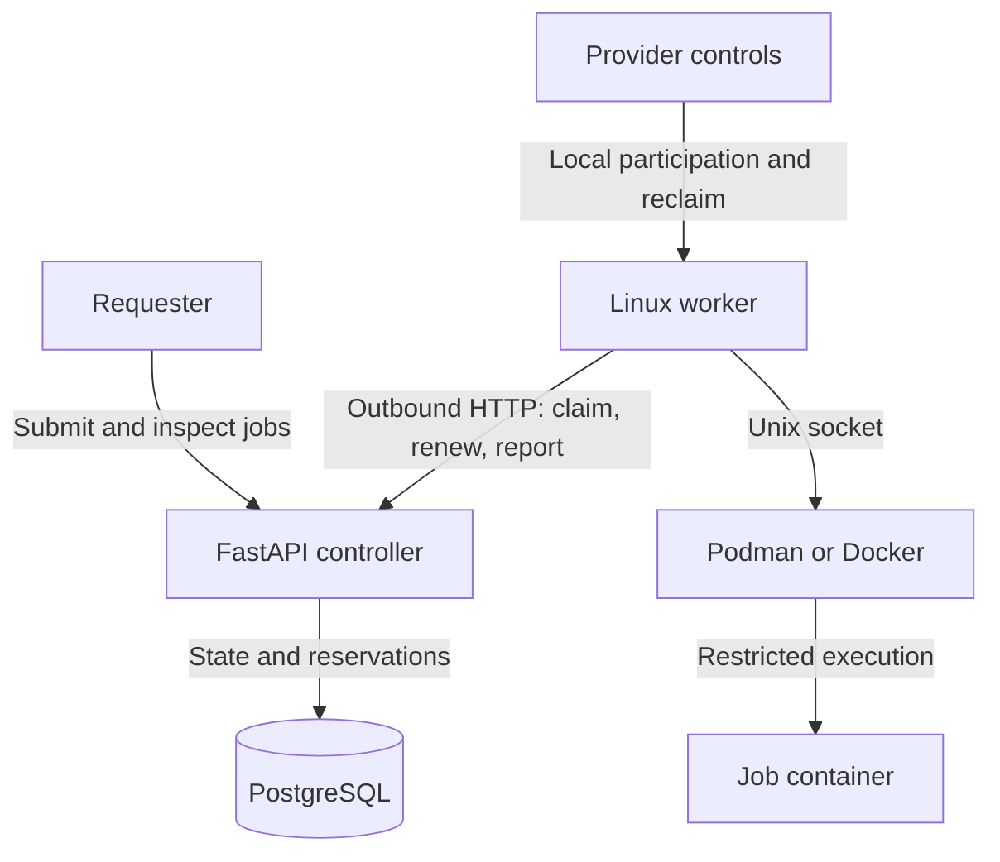

# MeshCompute at a glance

Implementation baseline: [`f77645a`](https://github.com/hwrigh4/MeshCompute/tree/f77645a5bc2ea6b5e456bd1b8bd99957db30d4a4) · 5 October 2026

MeshCompute runs non-sensitive container jobs on provider-owned Linux machines. Providers choose how much CPU and memory to contribute and can reclaim their resources. A central controller tracks assignments and retries interrupted work.

## Read more

| Document | Use it for | Download |
| --- | --- | --- |
| [Architecture guide](architecture.md) | Components, data model, job lifecycle, leases, security and design gaps | [PDF](pdf/MeshCompute-Architecture.pdf) |
| [Operations runbook](operations.md) | Setup, execution, provider controls, inspection, troubleshooting and testing | [PDF](pdf/MeshCompute-Operations.pdf) |

[`PROJECT.md`](../../PROJECT.md) defines the intended design. These guides describe the implementation at the baseline above and explicitly identify differences.

## How it fits together

1. A requester submits an image, command, CPU/memory request and timeout.
2. A healthy worker asks for work; the controller atomically reserves capacity for the oldest compatible fitting queued job.
3. The worker runs a restricted container while renewing its lease and sending separate heartbeats.
4. After cleanup, the controller records the result and releases the reservation. Lost or preempted attempts requeue only while the attempt budget remains.

## The rules that matter

| Rule | Meaning |
| --- | --- |
| Capacity = contribution minus reservations | CPU utilization is telemetry, not scheduling capacity. |
| Heartbeats every 5 seconds | Health becomes degraded at 15 seconds and offline after 30 seconds without a heartbeat. |
| Leases last 30 seconds; renew every 10 | Heartbeats do not renew ownership. Expired attempts are recovered by a scan approximately every 5 seconds. |
| Execution is at least once | Work may run again after an unrecorded result; workloads should tolerate duplicates. |
| Local provider control wins | `stop-all` reclaims resources without controller connectivity; database release is separate. |
| Reconcile before claiming | Stale owned containers are cleaned; valid surviving work is not adopted; ambiguous ownership requires inspection. |

## Operations quick reference

Run from the repository root with the virtual environment active. See the runbook for prerequisites, worker credentials and image setup.

| Command | Purpose |
| --- | --- |
| `make dev-up COMPOSE=podman-compose` | Start the local database, migrate and run the controller in the foreground |
| `make dev-state` | Inspect jobs, attempts and reservations |
| `mesh-worker` | Heartbeat/reconciliation agent; does not execute jobs |
| `mesh-worker work-once` | Claim and execute at most one job, then exit |
| `mesh-worker pause` / `drain` / `resume` | Change participation; pause/drain leave active work running |
| `mesh-worker stop-all` | Pause and reclaim this worker identity's workloads |
| `mesh-worker reconcile` | Diagnose and reconcile local execution against controller state |
| `make test-execution` | Exercise real end-to-end execution with a running controller |

## Current limits

- This is a trusted local MVP. Requester APIs and worker registration are unauthenticated; there is no public marketplace or production multi-tenancy.
- Execution is explicit and one-shot. `claim` alone creates a reservation but launches nothing.
- Requester cancellation works only for queued jobs. Ordinary failures/timeouts are terminal; only `LOST` and `PREEMPTED` retry.
- Lowering contribution does not currently preempt active work, despite the intended design in `PROJECT.md`; use `stop-all` to reclaim immediately.
- Workload networking is disabled. Output is limited to 64 KiB tails per stream; providers can inspect workloads and their data.
- `make test-local` covers runtime and assignment checks, not every suite. Recovery/provider/reconciliation tests own their controller; scheduler tests require a destructive reset. Follow the runbook's setup table.
