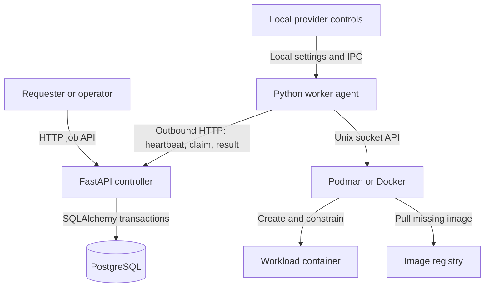
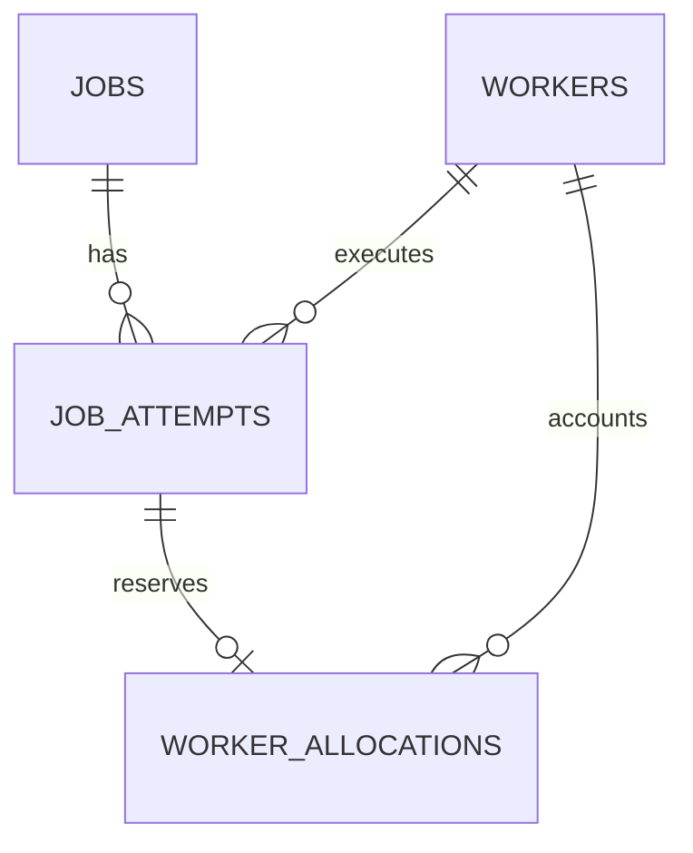
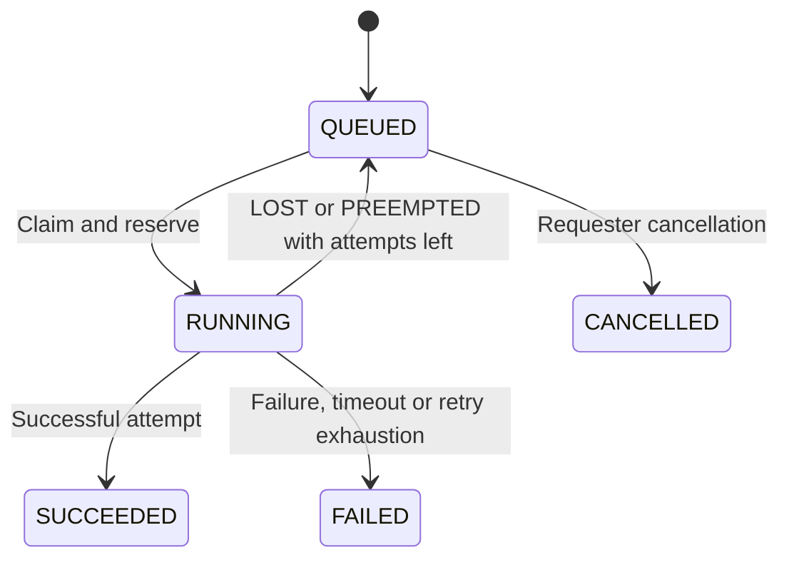

# MeshCompute Architecture Guide

Version 1.0 · 5 October 2026 · Implementation snapshot `f77645a5bc2ea6b5e456bd1b8bd99957db30d4a4`

> This guide and its PDF describe the Phase 8 snapshot above. Phase 9 metrics and
> structured logging are documented in [development](../development.md#phase-9-logs-and-metrics).

## 1. Purpose and scope

MeshCompute coordinates non-sensitive container workloads on provider-owned Linux machines. A central controller records jobs, assigns temporary execution leases, and accounts for contributed CPU and memory. Workers initiate all controller communication and execute workloads through local Podman or Docker APIs.

The defining constraint is that providers can reclaim their machines. Reliability comes from leases, bounded retries, and reconciliation across unreliable workers. The current implementation is a local compute MVP; a paid marketplace, public multi-tenant service, and continuously polling execution agent are not implemented.

This guide describes the code at the snapshot above. `PROJECT.md` remains the product and architecture source of truth. Section 9 explicitly records differences between that intended design and current behavior. The companion Operations Runbook covers commands and incident handling.

## 2. Components and communication



| Component | Responsibility | Main source |
| --- | --- | --- |
| FastAPI controller | Worker/job APIs, authenticated attempt mutations, recovery task | `controller/main.py`, `controller/api/` |
| Claim scheduler | Select oldest fitting queued job; reserve resources atomically | `controller/scheduler/claims.py` |
| PostgreSQL | Durable job/attempt state, worker identities, reservation ledger, lease deadlines | `controller/models/` |
| Worker agent | Reconcile, heartbeat, explicitly claim, renew, execute and report | `worker/agent/` |
| Container executor | Engine selection, image acquisition, isolation policy, output and cleanup | `worker/executors/` |
| Provider controls | Local participation settings and stop-all, independent of controller availability | `worker/preemption/control.py` |
| Local lab | Repeatable runtime, assignment, execution and recovery checks | `local_test/`, `Makefile` |

The controller does not push commands to workers or connect to their container engines. Workers do not access PostgreSQL. Workload network access is disabled, but the host engine can contact a registry to acquire an image. No message broker, object store, Kubernetes cluster, or peer-to-peer discovery service is present.

The local Compose file runs PostgreSQL 17 only. The controller runs as a Uvicorn process and workers run as Python processes. Default database and controller listeners are on loopback. This layout can represent multiple logical worker identities on one lab host; it does not prove those identities have separate physical capacity.

## 3. Ownership and resource accounting

Three authorities have different responsibilities: the provider controls actual local resources; PostgreSQL controls assignment and reservation records; a lease controls whether a worker may continue an attempt. Local container removal and controller allocation release are separate events.

For each resource, schedulable capacity is `max(0, contributed capacity - active reservations)`. Physical capacity limits the advertised contribution. CPU utilization and currently free memory are telemetry, not the scheduling ledger. A healthy worker can contribute zero capacity and receive no work.

Example: a host has 12 logical CPUs, contributes 8, and has 5 reserved. Its allocatable CPU is 3. If the provider changes contribution to 4 while reservations remain 5, allocatable CPU becomes 0. Current code leaves that active workload running; it does not automatically reclaim the excess.

Reservations use PostgreSQL `NUMERIC` CPU values and integer MiB memory. Job CPU requests and worker contributions are stored as floating-point values; claim code converts to decimal for reservation arithmetic and checks the float boundary again. Heartbeats never overwrite the reservation ledger.

### Scheduling transaction

1. Lock the requesting worker row and reload its current contribution and capabilities.
2. Require effective state `HEALTHY`, compatible runtime, and sufficient unreserved CPU and memory.
3. Select the oldest fitting `QUEUED` job, ordered by creation time then ID, using `FOR UPDATE SKIP LOCKED`.
4. Create a numbered `LEASED` attempt, its allocation, and a persisted lease deadline; mark the job `RUNNING`.
5. Commit all assignment changes before returning the assignment.

Worker locking serializes that identity's concurrent claims and contribution updates. The job lock prevents concurrent assignment and serializes queued cancellation. Locked, oversized, or incompatible earlier jobs can be skipped. Placement is oldest-compatible-first for the requesting worker, not global best-fit placement. CPU architecture is advertised but is not a claim filter in this snapshot.

## 4. Persistence and public contracts



| Entity | Important fields and invariants |
| --- | --- |
| `workers` | UUID, token hash, reported state, last heartbeat, physical/contributed resources, JSONB executor and engine capabilities, telemetry. Reserved amounts are derived from allocations. |
| `jobs` | Image, command array, runtime, requested resources, timeout, maximum attempts, state and timestamps. Nullable `owner_id` is reserved for future identity and is not a client field. |
| `job_attempts` | Job/worker foreign keys, unique `(job_id, attempt_number)`, engine, lease deadline, outcome, timestamps and bounded output tails. Active attempts must have a lease deadline. |
| `worker_allocations` | Attempt ID is the primary key, allowing at most one allocation per attempt; worker foreign key and positive finite CPU/memory reservations. |

Capabilities are fields on `workers`, not a separate capabilities table. Migrations are explicit through Alembic; application startup does not create the schema. The reviewed migration head is `0006`.

The API uses JSON over HTTP. Define `W = /v1/workers/{worker_id}` and `A = W/attempts/{attempt_id}` for the table below.

| Route | Authorization and behavior |
| --- | --- |
| `POST /v1/workers/register` | Unauthenticated registration; returns UUID and plaintext token once; only token hash persists. |
| `GET /v1/workers` | Unauthenticated listing with effective health and ledger-derived capacity. |
| `POST W/heartbeat` | Worker bearer token; updates reported state/resources/capabilities. Does not renew attempt leases. |
| `POST W/claim` | Worker bearer token; assignment or HTTP 204. Worker sends the actual claim once. |
| `POST W/reconcile` | Worker bearer token; bounded view of expected and supplied attempt IDs. |
| `POST A/start`, `A/renew`, `A/result`, `A/missing` | Worker bearer token plus assignment ownership and state checks. Results use one endpoint, not separate complete/fail/preempt endpoints. |
| `POST /v1/jobs`, `GET /v1/jobs`, `GET /v1/jobs/{id}` | Unauthenticated submission and inspection in the local MVP. |
| `POST /v1/jobs/{id}/cancel` | Cancels queued jobs; already-cancelled requests are idempotent; other states return 409. |
| `GET /v1/attempts/{id}` | Unauthenticated inspection, including result and output tails. |
| `GET /health` | Checks database connectivity; 200 or 503. Does not verify migrations. |

OpenAPI is available at `/docs`. No `/metrics` route is implemented. Heartbeats carry active attempt observations, but the heartbeat handler neither persists those IDs nor uses an omitted ID to declare loss. Dedicated reconciliation performs that comparison.

## 5. Execution and state lifecycle

`mesh-worker` runs heartbeats and reconciliation. `mesh-worker claim` reserves one job without launching it. `mesh-worker work-once` owns heartbeats, claims at most one assignment, executes it, reports, and exits. It does not poll indefinitely. A local process lock prevents two `work-once` processes from executing the same worker identity on the same host/user; it is not a cross-host identity lock.

```mermaid
sequenceDiagram
    participant W as Worker
    participant C as Controller
    participant D as PostgreSQL
    participant E as Container engine
    W->>C: Reconcile and heartbeat
    W->>C: Claim once
    C->>D: Lock, reserve, create leased attempt
    D-->>C: Commit
    C-->>W: Assignment and lease timings
    W->>E: Ensure image, create, verify, attach output
    W->>C: Record attempt start
    W->>E: Start workload
    loop During preparation and execution
        W->>C: Renew lease; heartbeat separately
    end
    E-->>W: Exit and output
    W->>E: Confirm cleanup
    W->>C: Report terminal result
    C->>D: Update attempt/job and release allocation
```

The worker prefers a usable configured Podman socket in `auto` mode, then Docker. Explicit engine selection does not fall back. The default Podman socket is the current user's service; selection itself does not attest that a custom socket is rootless.

The worker uses a cached image if present, otherwise requests a pull with a bounded deadline. It pins the local image ID for creation, rejects image-declared volumes, creates the container without starting it, verifies restrictions, and attaches output before reporting start. The actual engine start follows the accepted start report. Thus job `RUNNING` means assigned, while even attempt `RUNNING` has a short pre-launch interval; neither timestamp is an independent measurement of application readiness.



| Attempt outcome | Job outcome | Retry behavior |
| --- | --- | --- |
| `SUCCEEDED` | `SUCCEEDED` | None |
| `FAILED` | `FAILED` | Ordinary failures are terminal |
| `TIMED_OUT` | `FAILED` | No automatic retry |
| `PREEMPTED` | `QUEUED` or `FAILED` | Retry only while total attempts remain |
| `LOST` | `QUEUED` or `FAILED` | Retry only while total attempts remain |

An attempt begins `LEASED` and normally becomes `RUNNING`. Preparation failures or provider preemption may finish it while still leased. The `CANCELLED` attempt enum exists, but there is no implemented active requester-cancellation transition. `max_attempts` includes the initial execution.

Results and allocation deletion commit atomically. An identical terminal-result replay returns the recorded result; a conflicting replay returns 409. An expired active lease cannot start, renew, or accept a new result, even before recovery scans it.

## 6. Leases, recovery and reconciliation

| Timing | Current value | Meaning |
| --- | --- | --- |
| Heartbeat cadence | 5 seconds | Worker communication and capability observation |
| Health freshness | Under 15 seconds | Fresh; reported participation/runtime state still applies |
| Stale heartbeat | 15 through 30 seconds | Effective `DEGRADED` |
| Offline heartbeat | More than 30 seconds | Effective `OFFLINE` |
| Attempt lease | 30 seconds | Temporary authority to execute |
| Renewal interval | 10 seconds | Normal renewal target |
| Recovery cadence | 5 seconds | Up to 100 expired candidates per scan; not a hard recovery SLA |
| Reconciliation cadence | 30 seconds | Also at startup, reconnect, and before claims |

Worker health and attempt ownership are independent. A heartbeat-only worker can remain healthy while a diagnostic claim expires. Effective health is derived at read/claim time; stale state need not be written back to the worker row.

Lease deadlines use PostgreSQL `clock_timestamp()` after transaction locks. The worker measures a conservative monotonic deadline from request-send time, so delayed responses do not add ownership time. Renewal failure beyond that deadline cancels local execution; stale success reports are suppressed.

The controller's lifespan task finds expired leased/running attempts, rechecks them under worker-to-job-to-attempt locks, marks them `LOST / LEASE_EXPIRED`, removes allocations, and applies retry limits in one transaction. Persisted deadlines survive controller restarts. Database contention and outages can delay recovery beyond the nominal scan interval.

Reconciliation compares controller expectations with bounded engine discovery. It scans labels for worker, job and attempt ownership and rechecks immutable container IDs before deletion. Failed scans are not treated as empty scans. A missing running workload is declared `LOST / WORKLOAD_MISSING` only after matching job, engine, allocation and exact lease context. Leased image preparation is not inferred missing.

Valid discovered workloads are not adopted or renewed. They block new claims until resolved. Stale attributable containers can be removed; unrelated containers and attached persistent volumes are preserved. Legacy containers without enough ownership evidence require manual inspection. Live executor cleanup is protected from competing reconciliation.

Execution has at-least-once semantics: a completed workload with an unrecorded result can run again, and a hard-dead worker can leave an orphan overlapping a retry elsewhere. Lease fencing protects controller state, not arbitrary external side effects. Workloads should tolerate duplicate execution; checkpointing and result verification are absent.

## 7. Local provider authority

Provider settings persist in a per-worker `provider.json`, with owner-only directory/file permissions and atomic replacement. They contain participation, contribution and a stop sequence, not credentials. A same-user Unix socket communicates with a live execution session. These mechanisms require no controller token for local commands.

Pause and drain block new claims and leave active work running. Resume allows claims when runtime health and capacity permit. Resource changes affect future claims and heartbeat advertisement. `stop-all` pauses participation, interrupts live work, waits for confirmed local cleanup and reclaims explicitly worker-labeled leftovers. Controller release occurs separately through an accepted result or recovery.

If stop-all can report a live preemption under its valid lease, the attempt becomes `PREEMPTED`. During disconnection, the controller may instead recover it as `LOST`. Ordinary SIGINT/SIGTERM interruption is not the dedicated provider-preemption path; current execution code can report `FAILED / WORKER_INTERRUPTED` when ownership remains valid.

## 8. Security and workload boundaries

| Boundary | Implemented protection | Remaining limitation |
| --- | --- | --- |
| Worker to controller | Random bearer token, SHA-256 hash at rest, constant-time comparison and assignment ownership checks | No requester accounts, registration control, token rotation or revocation workflow |
| Workload to host | UID/GID 65532, no privileged mode, all capabilities dropped, no-new-privileges, no host binds/devices/namespaces, read-only root | Containers share the host kernel; this is not a hostile multi-tenant security guarantee |
| Resource consumption | CPU quota, memory/swap policy, 64 PID limit, bounded tmpfs and timeout | Image acquisition/cache disk growth is not comprehensively quota-managed |
| Network | Workload network mode `none`; engine socket is not exposed inside workload | Host/engine still needs controller/registry connectivity |
| Output | 64 KiB UTF-8 tail per stream, truncation flags, engine logging disabled, 800 KiB attempt-body cap | No durable full logs or artifact storage |
| Requester confidentiality | Non-sensitive workload scope is explicit | Providers can inspect code, data, memory and output; results are not independently verified |

The writable workload locations `/tmp` and `/mesh/work` are each 16 MiB tmpfs with restrictive mount options; shared memory is configured to 16 MiB. Jobs cannot request arbitrary mounts or engine privileges. Commands are argument arrays; the platform does not implicitly invoke a shell. A requester may explicitly submit a shell executable inside the restricted container.

Transport outside localhost requires HTTPS or an equivalently protected connection. HTTPS alone does not add authorization to the open job/inspection/registration APIs.

## 9. Design gaps and next decisions

| Intended design or future capability | Current snapshot | Consequence |
| --- | --- | --- |
| Preempt enough work after capacity reduction | Active work remains unchanged | Meaningful conflict with `PROJECT.md`; decide and implement reclamation semantics |
| Selectively cancel a provider attempt | No local `cancel <attempt-id>` action | `stop-all` is the implemented reclaim control |
| Requester cancellation | Queued jobs only | Active cancellation requires a new protocol/state path |
| Global best-fit placement | Oldest fitting job per pull | No fleet-wide packing optimization |
| Broad capability matching | Runtime and CPU/memory only | Architecture/platform compatibility is not enforced by scheduling |
| Long-running execution agent | Explicit one-shot execution | Continuous polling and multiple concurrent jobs need deliberate design |
| Active-attempt heartbeat reconciliation | IDs are observations; separate reconcile endpoint performs comparison | Do not infer loss from heartbeat omission |
| Observability phase | Basic logs, health API and local lab checks | Prometheus metrics and production dashboards are not implemented |
| Public/cloud operation | Local development topology | Authentication, deployment, backups, monitoring and operating policy remain future work |

Older README phase text says execution selection, local controls and reconciliation are absent; current code implements them. Existing focused lab checks also supersede early statements that no tests exist. This guide preserves those distinctions instead of treating every roadmap item as complete.

## 10. Evidence and maintenance

Repository: [hwrigh4/MeshCompute](https://github.com/hwrigh4/MeshCompute). Source baseline: [f77645a](https://github.com/hwrigh4/MeshCompute/tree/f77645a5bc2ea6b5e456bd1b8bd99957db30d4a4).

The source manifest below identifies the reviewed implementation. Read paths at the pinned commit, rather than assuming a later default branch is identical.

| Topic | Source paths |
| --- | --- |
| Product constraints | `AGENTS.md`, `PROJECT.md` |
| API and persistence | `controller/api/`, `controller/models/`, `common/schemas/` |
| Scheduling and leases | `controller/scheduler/claims.py`, `controller/services/attempts.py`, `lease_policy.py`, `recovery.py`, `retry.py`, `worker/agent/leases.py` |
| Reconciliation | `controller/services/reconciliation.py`, `worker/agent/reconciliation.py`, `worker/agent/loop.py` |
| Execution and controls | `worker/main.py`, `worker/agent/claim.py`, `execution.py`, `worker/executors/`, `worker/preemption/control.py` |
| Local topology and checks | `docker-compose.yml`, `pyproject.toml`, `Makefile`, `local_test/README.md`, `docs/development.md` |

This was a source review, not a new runtime test run. Update this document when routes, state transitions, reservation ownership, timing policy, runtime isolation or deployment topology change. Keep intended behavior and implemented behavior separately labeled.
